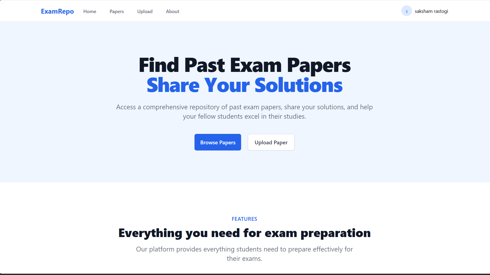
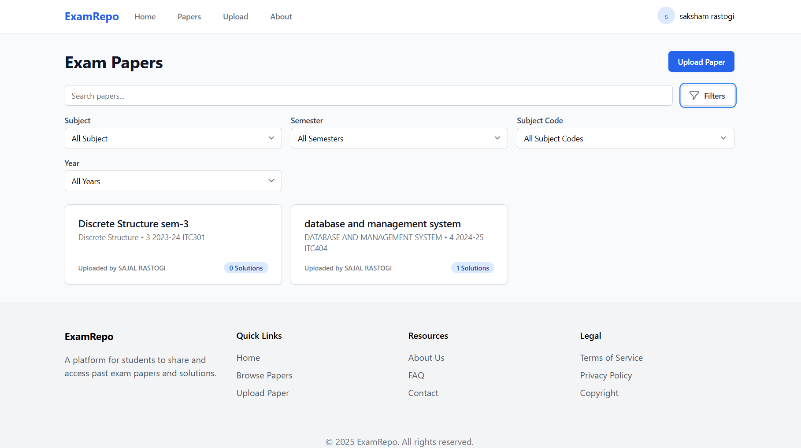
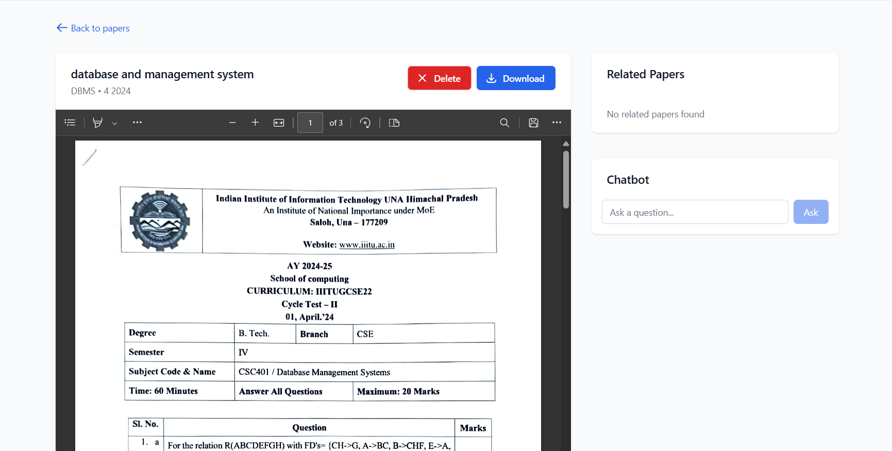

# 📘 Exam Repo

A full-stack web application for storing and accessing college exam papers. Students can upload past exam papers, view others' submissions, contribute solutions with upvotes, and interact with a chatbot to get help.

## 🚀 Features

- 🗂️ Upload and access college exam papers
- 🧠 Submit solutions and upvote helpful answers
- 💬 Integrated chatbot to ask questions and get guidance
- 🔍 Search and filter papers/solutions
- 👥 Community-driven content contribution

## 🛠 Tech Stack

- **Frontend**: React.js, Tailwind CSS
- **Backend**: Node.js, Express.js
- **Database**: MongoDB
- **Authentication**: JWT (optional)
- **Other**: OpenAI API (for chatbot)

## 📸 Screenshots

_Add your screenshots in the `/assets` folder and update these links accordingly._

### 🏠 Home Page


### 📄 Paper Detail View


### 💬 Chatbot


## 🔧 Installation

```bash
# Clone the repo
git clone https://github.com/your-username/exam-repo.git
cd exam-repo

# Install frontend dependencies
cd frontend
npm install
npm start

# Install backend dependencies
cd backend
npm install
npm start server
